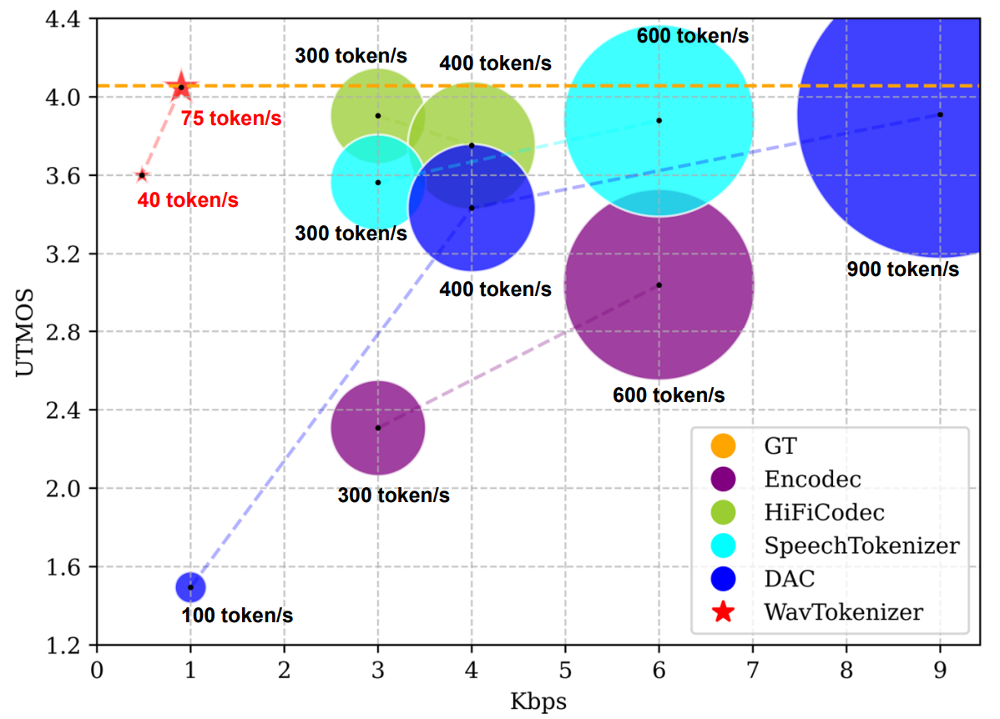

# WavTokenizer
SOTA Discrete Codec Models With Forty Tokens Per Second for Audio Language Modeling 


[](https://arxiv.org/abs/2408.16532)
[](https://wavtokenizer.github.io/)
[](https://huggingface.co/novateur/WavTokenizer)


### 🎉🎉 with WavTokenizer, you can represent speech, music, and audio with only 40 tokens per second!
### 🎉🎉 with WavTokenizer, You can get strong reconstruction results.
### 🎉🎉 WavTokenizer owns rich semantic information and is build for audio language models such as GPT4-o.

# 🔥 News
- *2024.08*: We release WavTokenizer on arxiv.




## Installation

To use WavTokenizer, install it using:

```bash
conda create -n wavtokenizer python=3.9
conda activate wavtokenizer
pip install -r requirements.txt
```

## Infer

### Part1: Reconstruct audio from raw wav

```python

from encoder.utils import convert_audio
import torchaudio
import torch
from decoder.pretrained import WavTokenizer


device=torch.device('cpu')

config_path = "./configs/xxx.yaml"
model_path = "./xxx.ckpt"
audio_outpath = "xxx"

wavtokenizer = WavTokenizer.from_pretrained0802(config_path, model_path)
wavtokenizer = wavtokenizer.to(device)


wav, sr = torchaudio.load(audio_path)
wav = convert_audio(wav, sr, 24000, 1) 
bandwidth_id = torch.tensor([0])
wav=wav.to(device)
features,discrete_code= wavtokenizer.encode_infer(wav, bandwidth_id=bandwidth_id)
audio_out = wavtokenizer.decode(features, bandwidth_id=bandwidth_id) 
torchaudio.save(audio_outpath, audio_out, sample_rate=24000, encoding='PCM_S', bits_per_sample=16)
```


### Part2: Generating discrete codecs
```python

from encoder.utils import convert_audio
import torchaudio
import torch
from decoder.pretrained import WavTokenizer

device=torch.device('cpu')

config_path = "./configs/xxx.yaml"
model_path = "./xxx.ckpt"

wavtokenizer = WavTokenizer.from_pretrained0802(config_path, model_path)
wavtokenizer = wavtokenizer.to(device)

wav, sr = torchaudio.load(audio_path)
wav = convert_audio(wav, sr, 24000, 1) 
bandwidth_id = torch.tensor([0])
wav=wav.to(device)
_,discrete_code= wavtokenizer.encode_infer(wav, bandwidth_id=bandwidth_id)
print(discrete_code)
```


### Part3: Audio reconstruction through codecs
```python
# audio_tokens [n_q,1,t]/[n_q,t]
features = wavtokenizer.codes_to_features(audio_tokens)
bandwidth_id = torch.tensor([0])  
audio_out = wavtokenizer.decode(features, bandwidth_id=bandwidth_id)
```

## Available models
🤗 links to the Huggingface model hub.

| Model name                                                          |                                                                                                            HuggingFace                                                                                                             |  Corpus  |  Token/s  | Domain | Open-Source |
|:--------------------------------------------------------------------|:------------------------------------------------------------------------------------------------------------------------------------------------------------------------------------------------------------------------------------:|:--------:|:---------:|:----------:|:------:|
| WavTokenizer-small-600-24k-4096             |             [🤗](https://huggingface.co/novateur/WavTokenizer/blob/main/WavTokenizer_small_600_24k_4096.ckpt)    | LibriTTS  | 40  |  Speech  | √ |
| WavTokenizer-small-320-24k-4096             |             [🤗](https://huggingface.co/novateur/WavTokenizer/blob/main/WavTokenizer_small_320_24k_4096.ckpt)     | LibriTTS  | 75 |  Speech  | √|
| WavTokenizer-medium-600-24k-4096               |               [🤗](https://github.com/jishengpeng/wavtokenizer)         | 10000 Hours | 40  |  Speech, Audio, Music  | Coming Soon|
| WavTokenizer-medium-320-24k-4096                 |               [🤗](https://github.com/jishengpeng/wavtokenizer)         | 10000 Hours | 75 |  Speech, Audio, Music  | Coming Soon|
| WavTokenizer-large-600-24k-4096 | [🤗](https://github.com/jishengpeng/wavtokenizer) | 80000 Hours | 40 |   Speech, Audio, Music   | Coming Soon|
| WavTokenizer-large-320-24k-4096   | [🤗](https://github.com/jishengpeng/wavtokenizer) | 80000 Hours | 75 |   Speech, Audio, Music   | Coming Soon |

      

## Training

### Step1: Prepare train dataset
```python
# Process the data into a form similar to ./data/demo.txt
```

### Step2: Modifying configuration files
```python
# ./configs/xxx.yaml
# Modify the values of parameters such as batch_size, filelist_path, save_dir, device
```

### Step3: Start training process
Refer to [Pytorch Lightning documentation](https://lightning.ai/docs/pytorch/stable/) for details about customizing the
training pipeline.

```bash
cd ./WavTokenizer
python train.py fit --config ./configs/xxx.yaml
```


## Citation

If this code contributes to your research, please cite our work, Language-Codec and WavTokenizer:

```
@misc{ji2024wavtokenizerefficientacousticdiscrete,
      title={WavTokenizer: an Efficient Acoustic Discrete Codec Tokenizer for Audio Language Modeling}, 
      author={Shengpeng Ji and Ziyue Jiang and Xize Cheng and Yifu Chen and Minghui Fang and Jialong Zuo and Qian Yang and Ruiqi Li and Ziang Zhang and Xiaoda Yang and Rongjie Huang and Yidi Jiang and Qian Chen and Siqi Zheng and Wen Wang and Zhou Zhao},
      year={2024},
      eprint={2408.16532},
      archivePrefix={arXiv},
      primaryClass={eess.AS},
      url={https://arxiv.org/abs/2408.16532}, 
}

@misc{ji2024languagecodec,
      title={Language-Codec: Reducing the Gaps Between Discrete Codec Representation and Speech Language Models}, 
      author={Shengpeng Ji and Minghui Fang and Ziyue Jiang and Rongjie Huang and Jialung Zuo and Shulei Wang and Zhou Zhao},
      year={2024},
      eprint={2402.12208},
      archivePrefix={arXiv},
      primaryClass={eess.AS}
}
```

